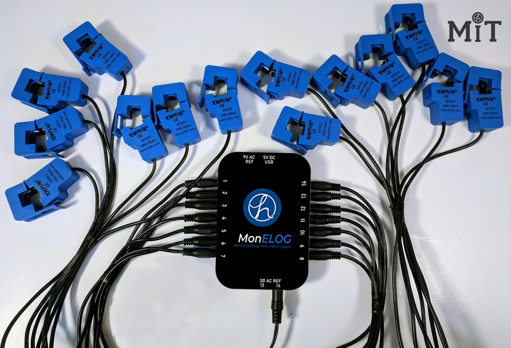

=========================================
MonELOG 
=========================================

Description
The Base unit is the hub of an MonELOG monitoring solution. This new version works the 
same as the V.1.0 MonELOG, but also adds additional jacks to natively connect up to three 
AC Voltage Reference transformers to facilitate direct reference three-phase. Another 
significant improvement is the use of a new enclosure with integrated wall mount.

Data Sheet :
    -    Runs open MonELOG software to monitor up to 14 circuits.
    -    Up to three voltage references for direct reference three-phase.
    -    Software pre-installed with automatic secure updates available.
    -    WiFi connected
    -    Browser based configuration and data analysis
    -    Saves data locally for up to 15 years
    -    Uploads data to PVoutput, Emoncms, and influxDB
    -    Measures Voltage, frequency, power (Watts), current (Amps), VA, energy (kWh) and power-factor.
    -    Single, split or three-phase
    -    120V or 230V or other with appropriate voltage reference transformer
    -    Software configurable to use any of dozens of current transformers
    -    Typical accuracy within 1%

